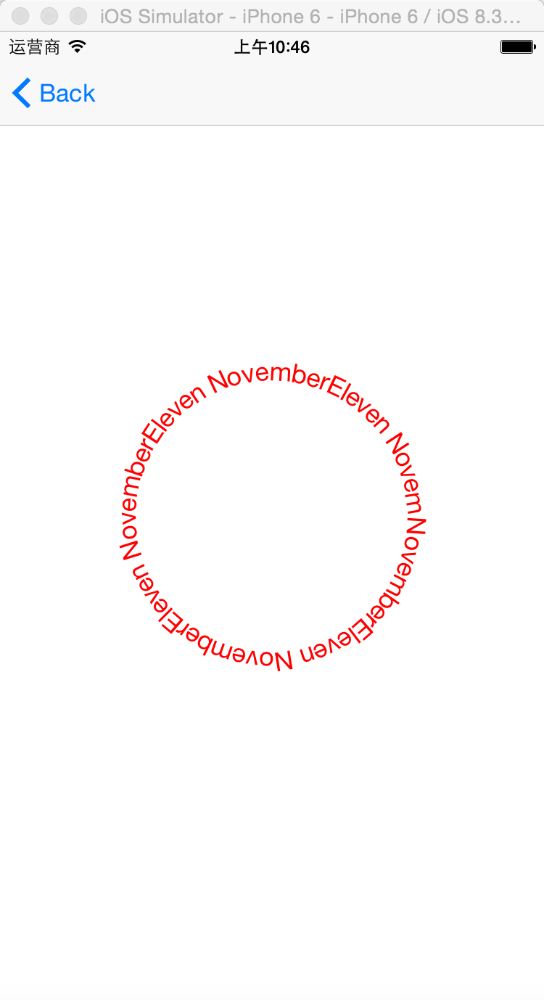
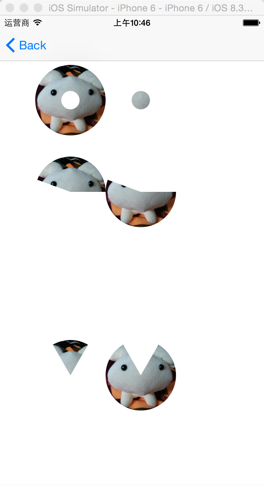

# iOS Core Graphics Test

1. BezierPath
2. Transforms
3. Custom Font
4. ArcText
5. Animation
6. CGContextClip
7. Clip and Arc and Animation

##Reference

[iOS-Drawing](https://github.com/erica/iOS-Drawing)